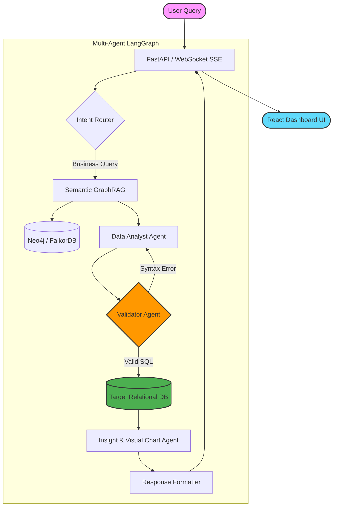

# StrongBI 🚀

<div align="center">
  <h3>Enterprise Text-to-SQL & BI Multi-Agent System</h3>
  <p>StrongBI is an autonomous Business Intelligence Agent that empowers non-technical users to query, analyze, and visualize relational databases using natural language. Built with a robust multi-agent architecture, it ensures high accuracy, enterprise-grade security, and real-time responsiveness.</p>

  <p>
    <a href="#-key-features">Features</a> •
    <a href="#-architecture">Architecture</a> •
    <a href="#-video-demo">Demo</a> •
    <a href="#-getting-started">Getting Started</a>
  </p>
</div>

---

## 🎥 Video Demo

<!-- DEMO_PLACEHOLDER_START -->
<div align="center">
  
</div>
<!-- DEMO_PLACEHOLDER_END -->

---

## ✨ Key Features

- **🧠 Autonomous BI Multi-Agent System:** Powered by LangGraph for iterative, self-correcting agentic workflows. Employs specialized agents (Data Analyst, Visualization Architect, Business Strategist) working in parallel to solve complex queries.
- **💬 Text-to-SQL with Semantic GraphRAG:** State-of-the-art Natural Language to SQL capability. Utilizes a dedicated Graph Database (FalkorDB/Neo4j) to map and understand database schemas, business logic, semantic relationships, and constraints dynamically.
- **🔁 Self-Healing SQL Validation:** Built-in error detection and auto-correction loops. The Validator Agent intercepts syntax errors or logical hallucinations and fixes them iteratively before execution. Never worry about faulty SQL again.
- **📊 Automated High-Aesthetic Visualizations:** Intelligently analyzes data dimensions to select the perfect chart type (Bar, Line, Pie, Area, Treemap, etc.). Generates robust, responsive Apache ECharts configurations on-the-fly with foolproof dataset injection.
- **📑 Executive Business Insights:** Automatically synthesizes query results into C-level, professional business reports following the McKinsey framework (What - So What - Now What).
- **⚡ Real-time Reasoning Streaming:** Asynchronous FastAPI backend coupled with Server-Sent Events (SSE) allows users to see the AI's "thought process" and intermediate steps in real-time.
- **📈 Interactive Custom Dashboards:** Fully customizable, drag-and-drop interactive dashboards built with React Grid Layout. Pin any generated chart from the chat directly into a personalized workspace with one click.
- **💡 Smart Question Recommender (AI Studio):** Intelligently suggests contextual, high-value business questions tailored to your specific database semantics and industry (categorized by Revenue, Customers, Products).
- **🔗 Seamless Multi-Database Connectivity:** Effortlessly connect and query across multiple data sources per tenant (PostgreSQL, MySQL, SQLite, etc.) through a unified interface.
- **🔐 Enterprise Security & RBAC:** Multi-tenant workspace architecture with strict Role-Based Access Control (Admin, Analyst, Viewer). Controls tab visibility (Chart, Data, SQL) based on user permissions.
- **🌐 LLM Agnostic & Future-Proof:** Out-of-the-box support for leading LLM providers (OpenAI, Google Gemini, Anthropic) as well as self-hosted, privacy-first models (vLLM, Ollama) via LiteLLM routing.

---

## 🏗️ Architecture

StrongBI leverages a multi-agent LangGraph system orchestrating specialized agents to ensure absolute precision from prompt to chart.



### Agent Roles:
1. **Semantic GraphRAG (Retrieve):** Extracts deep database schema and business context.
2. **Data Analyst Agent (Text2SQL):** Generates optimized SQL queries based on semantics.
3. **Validator Agent (Self-Correction):** Automatically detects and fixes SQL syntax and logical errors through an iterative loop.
4. **Insight & Visual Chart Agent:** Interprets the queried data and constructs precise Apache ECharts configurations.
5. **Format Agent:** Delivers human-readable insights directly to the user interface.

---

## 🛠️ Technology Stack

<div align="center">
  <table>
    <tr>
      <td align="center"><b>Backend</b></td>
      <td align="center"><b>Frontend</b></td>
      <td align="center"><b>DevOps & Data</b></td>
    </tr>
    <tr>
      <td>
        • Python 3.12<br>
        • FastAPI<br>
        • LangGraph<br>
        • LiteLLM<br>
        • SQLGlot<br>
        • SQLAlchemy
      </td>
      <td>
        • React 18 & TypeScript<br>
        • Vite<br>
        • Tailwind CSS<br>
        • shadcn/ui & Radix<br>
        • Apache ECharts<br>
        • Zustand / Context
      </td>
      <td>
        • Docker & Compose<br>
        • PostgreSQL (Auth/Meta)<br>
        • FalkorDB / Neo4j<br>
        • Uvicorn<br>
        • uv Package Manager
      </td>
    </tr>
  </table>
</div>

---

## 🚀 Getting Started

### Prerequisites
- Docker and Docker Compose
- Node.js (>= 18)
- Python 3.12+ (We highly recommend `uv` package manager)

### 1. Environment Setup
Clone the repository and set up the environment variables:
```bash
cp .env.example .env
# Edit .env with your specific LLM API keys (OPENAI_API_KEY, GEMINI_API_KEY, etc.)
```

### 2. Infrastructure (Databases)
Start the required foundational databases (PostgreSQL, FalkorDB/Neo4j) via Docker Compose:
```bash
docker-compose up -d
```

### 3. Backend Setup (Local Development)
```bash
# Install dependencies using uv
uv pip install -r requirements.txt

# Run the FastAPI server
uv run python3 -m uvicorn api.index:app --reload --port 8000
```

### 4. Frontend Setup (Local Development)
```bash
cd app
npm install
npm run dev
```

Navigate to `http://localhost:8080` to experience StrongBI.

---

## 📄 License
This project is licensed under the [MIT License](./LICENSE).
